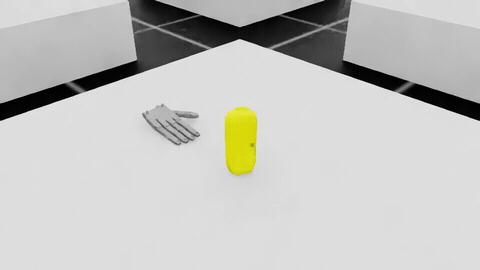
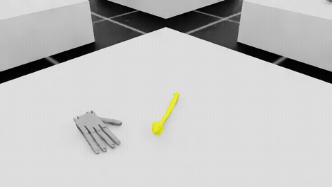
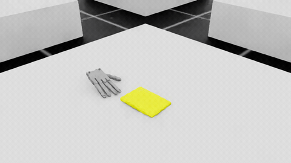
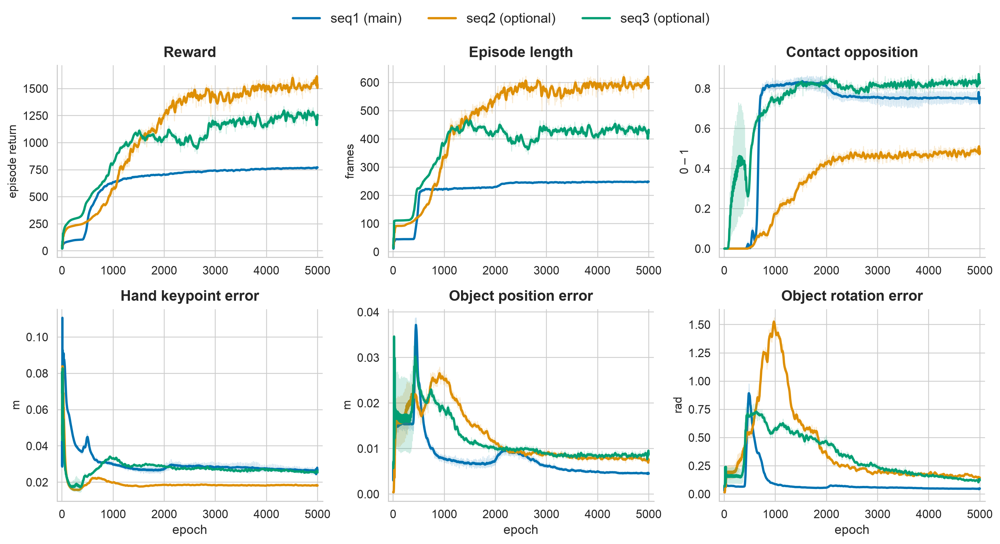

# HOCAP-PPO

Reinforcement learning that teaches a simulated Shadow Dexterous Hand to reproduce human
hand-object manipulation from the [HO-Cap](https://irvlutd.github.io/HOCap/) dataset. A PPO
policy tracks a reference MANO keypoint trajectory while grasping and reorienting a free-floating
object, trained GPU-parallel in NVIDIA Isaac Lab.


-EE4C2C)

<p align="center">
  
  
  
</p>
<p align="center"><sub>Trained policy on each of the three HO-Cap sequences (one episode each).</sub></p>

[Read the full report (PDF)](docs/report.pdf)

## Problem

A human demonstration is recorded as 21 MANO hand keypoints together with the object's 6-DoF
trajectory. The goal is to train a policy that imitates this demonstration in physics. The hand
must match the reference pose, follow the object's path, and form a stable grasp, using only
forces and joint targets, without access to ground-truth object dynamics.

The Isaac Lab direct-workflow extension provides the simulation scaffold. Everything below, the
MDP design and the training setup, is the contribution of this project. The original template
files keep their license headers, and the work is concentrated in `gr_env.py`, `gr_env_cfg.py`,
and the rl_games agent config.

## What this project implements

### Control scheme

The Shadow Hand has 22 degrees of freedom: a 6-DoF floating wrist and 18 actuated finger joints.
The 27-D action is split and applied through two separate channels.

* **Wrist (9-D).** A 3-D translation and a 6-D rotation are converted into an external
  force/torque on the palm. A moving average over consecutive steps damps the commanded force,
  which keeps the free-floating base from oscillating.
* **Fingers (18-D).** Joint-position targets are scaled to the joint limits, then smoothed with an
  exponential moving average and saturated. Lowering the smoothing factor from 0.5 to 0.3 removed
  most of the finger trembling. This is a control-level filter and is separate from any reward
  penalty.

### Observation (284-D)

The observation is assembled in `compute_full_observations`. It contains proprioception (joint
positions and velocities, wrist pose and twist), the object state, the reference tracking errors
for both the current and the next frame (keypoints, object position, object rotation), grasp
features relative to object-attached targets, saturated fingertip contact forces, the previous
action, and the normalized episode phase. The previous action is included because exponential
smoothing makes it the true control state. Rotations use a continuous 6-D representation instead
of quaternions to avoid discontinuities in the policy input.

### Reward design

Every tracking term is bounded as `w * exp(-k * error)`, so no single term can dominate and the
scale stays interpretable.

| Term | What it measures | Notes |
|---|---|---|
| Keypoint imitation | mean L2 over 21 MANO keypoints | decay sharpened (k from 20 to 30) to uncurl the index finger |
| Object position | L2 to the reference position | |
| Object rotation | geodesic quaternion distance | |
| Grasp | fingertips to object-attached target patches | targets re-rotate rigidly with the object pose |
| Contact | thumb-opposition force | gated to the reference grasp phase, so contact pays only when the human was grasping |
| Penalties | action magnitude and joint velocity | |

Two design choices mattered most.

1. **Thumb-opposition contact gate.** Rewarding raw contact force makes the policy press against
   anything. Rewarding the minimum of the thumb force and the opposing-finger force, gated by
   whether the reference hand was actually grasping, produces genuine pinch grasps instead of
   slapping the object.
2. **Early termination with non-negative reward.** An episode ends when the hand or the object
   diverges too far from the reference, and the total reward is clamped to be non-negative.
   Together these ensure that terminating early is never more profitable than continuing to track.

### Training setup

Training uses PPO from [rl_games](https://github.com/Denys88/rl_games) with thousands of
environments in parallel. The three HO-Cap sequences are selected at runtime through the `GR_SEQ`
environment variable, with no code edits. Training runs headless with the renderer off, and
videos are produced separately from a checkpoint.

## Results

<p align="center"></p>

Across all three sequences, episode return and episode length rise and plateau while the tracking
errors (hand keypoints, object position, object rotation) drop, and contact opposition climbs as
the policy learns to pinch rather than push the object. The trained policy follows the reference
hand to within about 1.8 to 2.7 cm and the object to within about 4.5 to 8.9 mm, depending on the
sequence.

## Quickstart

> Requires Linux and an NVIDIA GPU. Isaac Sim does not run on macOS.

```bash
# 1. Install Isaac Sim + Isaac Lab (official guide: conda or pip/uv), then:
python -m pip install -e source/gr      # install this extension
python scripts/list_envs.py             # verify tasks are registered

# 2. Train (headless; monitor reward curves in TensorBoard)
bash run_train.sh
GR_SEQ=2 bash run_train.sh              # pick HO-Cap sequence 1 (default), 2, or 3

# 3. Play a checkpoint and record a video
CKPT=/path/to/checkpoint.pth bash run_play.sh
```

Isaac Lab setup: [installation guide](https://isaac-sim.github.io/IsaacLab/main/source/setup/installation/index.html).
Registered tasks are `Gr_shadow_train` for training and `Gr_shadow_play` for evaluation with
debug markers.

## Project structure

```
scripts/rl_games/      PPO train.py / play.py (rl_games entry points)
source/gr/gr/
  asset/               Shadow Hand articulation cfg + USD
  tasks/direct/gr/     gr_env.py, gr_env_cfg.py  (the env/MDP, main contribution)
                       agents/rl_games_ppo_cfg.yaml
data/HOCAP/            reference grasp sequences (.pt) + object USDs
run_train.sh           run_play.sh
```

## Acknowledgements

* [HO-Cap dataset](https://irvlutd.github.io/HOCap/) (Wang et al., NeurIPS 2025) provides the
  reference grasp trajectories in `data/HOCAP/`, licensed under CC BY 4.0.
* [Isaac Lab](https://github.com/isaac-sim/IsaacLab) (BSD-3-Clause) provides the simulation
  scaffold and the direct-workflow extension template.

*Final project for a Reinforcement Learning course.*
